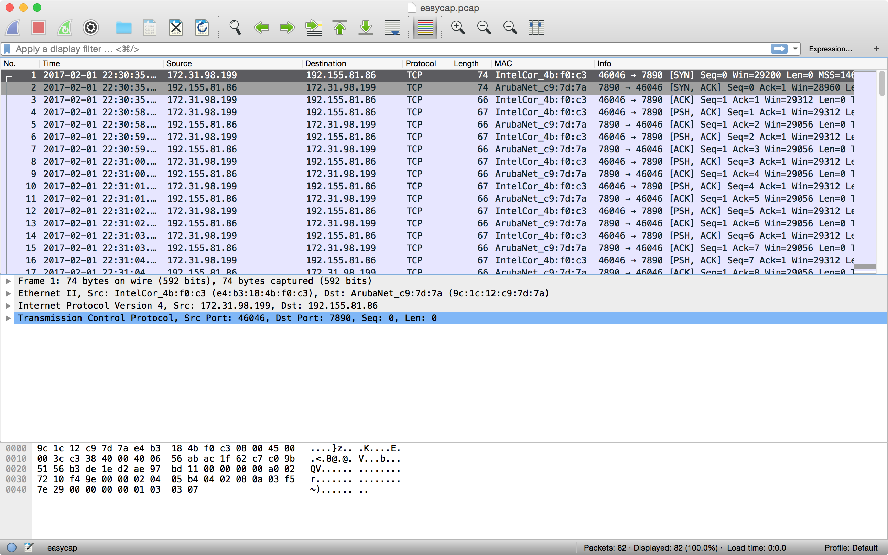
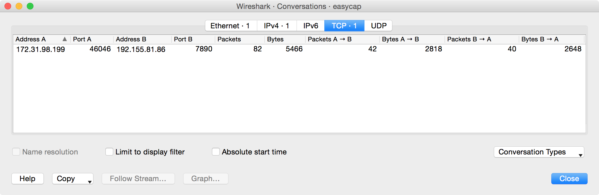
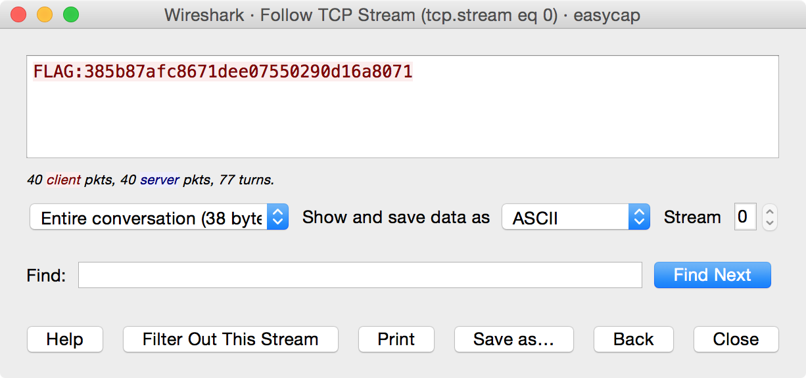

# easycap

## Challenge

> Can you get the flag from the packet capture?
> 
> * [easycap.pcap](attachments/easycap.pcap)

## Solution

In this challenge, we are presented with a [packet capture (`.pcap`) file](https://en.wikipedia.org/wiki/Pcap). Packet captures are records of network activity. The industry standard tool for examining network activity in real-time and forensically is [Wireshark](https://www.wireshark.org/), so the first thing I did is open the file with that tool. Wireshark displayed the recorded network activity by showing each individual packet:

It is immediately clear that this packet capture contains a conversation between two computers. The initiating computer's address is `172.31.98.199`, evidenced by the fact that its IP address is in Wireshark's "Source" column and the "Info" column shows it to be a TCP `SYN` ("synchronize") packet. Likewise, the receiving computer's address is `192.155.81.86`. We know this conversation was successfully established because this second computer's response (in the very next packet) is a `SYN/ACK` ("synchronize/acknowledment"), and the third packet is a plain `ACK` from the first computer. This is the pattern for how every successful TCP connection begins, the classic [TCP three-way handshake](http://www.inetdaemon.com/tutorials/internet/tcp/3-way_handshake.shtml).

Skimming through the list of packets by scrolling makes it pretty clear that the only records in this packet capture file is this one conversation. We can confirm this by using [Wireshark's Conversations](https://www.wireshark.org/docs/wsug_html_chunked/ChStatConversations.html) view by going to Statistics &rarr; Conversations from the menu bars. Each of the tabs in this view displays one line item:

At this point, the obvious next question is, "Okay, what was *said* during this conversation?" To find out, we use [Wireshark's "Follow TCP Stream" feature](https://www.wireshark.org/docs/wsug_html_chunked/ChAdvFollowTCPSection.html) by clicking on Analyze &rarr; Follow &rarr; TCP Stream (or right-click on one of the packets in the conversation and choose Follow &rarr; TCP Stream. This displays the conversation's data (the "stream content") just as it appeared when it was transmitted over the wire. It's color-coded, so that data being sent from the initiating computer to the responding computer is in one color and vice versa.

In this case, the conversation itself was the flag contents: `FLAG:385b87afc8671dee07550290d16a8071`.

