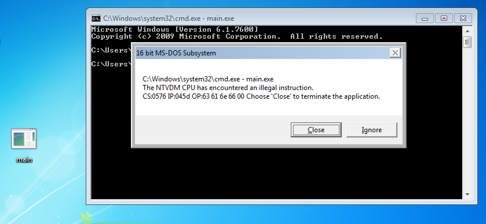
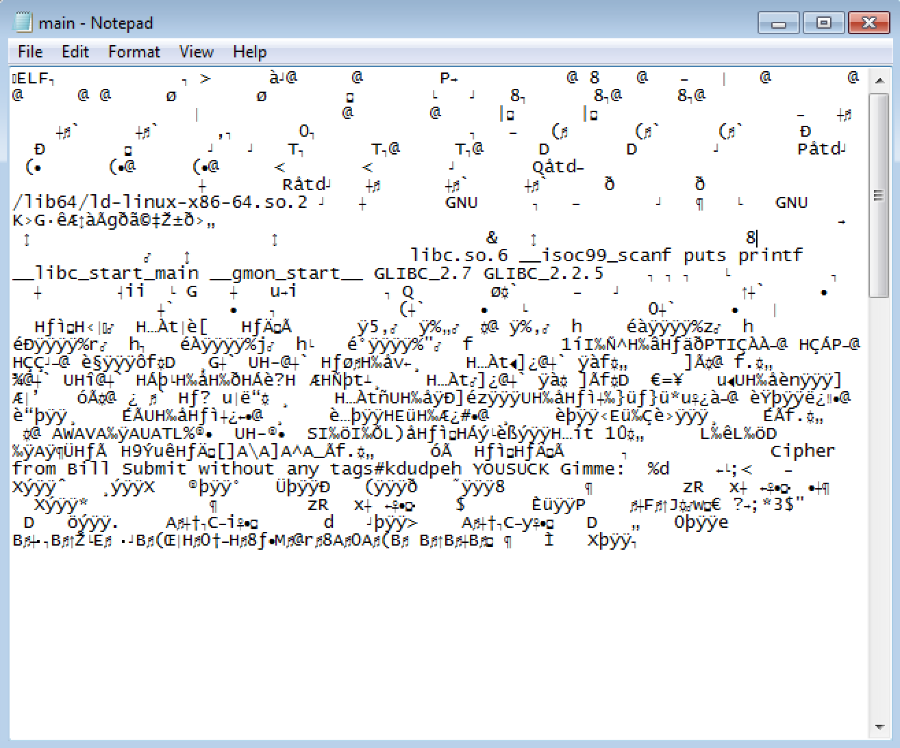

# Challenge

> Shal has got a binary. It contains the name of a wise man and his flag. He is unable to solve it.
> 
> Submit the flag to unlock the secrets of the universe.
> 
> * [main.exe](attachments/main.exe), MD5 file hash: `753097f903bc7165a5fb139dd12959d4`

# Solution

In this challenge we are given a very terse clue referencing someone named "Shal" and an unnamed "wise man," along with a single file to download. The file is called `main.exe`. By convention, a file whose name ends with [`.exe` is expected to be a certain kind of executable file](https://en.wikipedia.org/wiki/EXE), that is, a program written so that it can be run on a version of the [Microsoft Windows](https://simple.wikipedia.org/wiki/Microsoft_Windows) or another operating system. As per the challenge category ("[binary exploitation](https://trailofbits.github.io/ctf/exploits/binary1.html)"), we can expect that we must recover the flag by making this program do something it may not have been designed to do.

> :beginner: :warning: Before you read any further, you need to know that it's *very dangerous* to handle executable files that you don't recognize. The (correct) common sense advice is **do not run software that you got from strangers.** Sure, during a CTF, it's *usually* the case that applications are harmless, because the whole point of the CTF is that it's a fun puzzle game. However, these programs are still *executable*, and that means they can still do anything any other program can do, including installing malware, spreading viruses, implanting rootkits, setting up backdoors into your computer, and a lot of other scary things. These programs are still *real* programs that, if you execute them, you are *actually* running.
> 
> Given the danger, what are you to do if all you've got to work with is an executable file? The solution is to use the digital equivalent of a [cleanroom](https://en.wikipedia.org/wiki/Cleanroom), an environment that you can control and contain any "contamination" that may result from running programs that you don't trust. One very good and very convenient way to do this is to use a [virtual machine](https://simple.wikipedia.org/wiki/Virtual_machine). As the name implies, these are special programs that emulate a real computer system, but completely isolate the virtualized system (the "guest" machine) from your real one (the "host" machine). Since they are just a software program, and not a physical computer, you can safely expose them to possible infection and easily restore their original, uninfected state with the click of a mouse. Everything you'll read about in the remainder of this write-up was performed inside virtual machines, for this exact reason.
> 
> If you've never used a virtual machine (a "VM") before, I suggest you pause here and familiarize yourself with one or more virtual machine management systems (called "hypervisors") before you continue. One of the most popular VM hypervisors is called [VirtualBox](https://www.virtualbox.org/). It's free, it's reliable, and it runs well on macOS, GNU/Linux, and Windows computers. The [VirtualBox manual details its installation procedure](https://www.virtualbox.org/manual/ch02.html) on each of these host operating systems.

Perhaps the most obvious thing we can do when all we have is an executable file is to run it and see what happens. Given its name, we might expect to be able to run this `main.exe` program on a Windows computer. However, double-clicking on it or running it from a command prompt immediately reveals a problem:



Instead of successfully running the program, we are greeted with a Windows error message that says the "CPU has encountered an illegal instruction." The two buttons available to us, *Close* or *Ignore*, don't seem to present any obvious way forward. If we close the application, we are simply quitting it immediately. Clicking on *Ignore* simply gives us the same error again, this time with slightly different details on the last line of the error (the cryptic one that reads "CS:0576 IP:045d OP:63 61 6e 66 00").

An "illegal instruction" is serious. It means the computer totally didn't understand what the executable wanted it to do. Let's have several increasingly closer looks at the file itself to see why.

The most basic of all possible examinations we can perform is to use [Windows's command prompt](http://www.computerhope.com/issues/chusedos.htm)'s [`type` command](https://technet.microsoft.com/en-us/library/bb491026.aspx) to show us the contents of the file as though it were just a bunch of text:

```
C:\Users\Public\tmp>type main.exe
⌂ELF☻☺☺         ☻ > ☺   α♦@     @       P
C:\Users\Public\tmp>
```

What's useful in this output is near the very beginning: the text `ELF` is not what we would expect for a Windows executable. It's actually what we'd expect for a *GNU/Linux* program. If this were a Windows executable, we would expect to see the two letters `MZ` at the very beginning of `type`'s output. For example, here's what doing the same thing with the built-in Notepad program looks like:

```
C:\Users\Public\tmp>type C:\Windows\System32\notepad.exe
MZÉ ♥   ♦       ╕       @                                   α   ♫▼║♫ ┤  ═!╕☺L═!T
his program cannot be run in DOS mode.
$       ▓╛┬b÷▀¼1÷▀¼1÷▀¼1 º91⌡▀¼1 º?1δ▀¼1÷▀¡1 ▀¼1 º/1Θ▀¼1 º(1⌠▀¼1 º81≈▀¼1 º=1≈▀¼1
Rich÷▀¼1                PE  L☺♦ ☼╞[J        α ☻☺♂☺        ¿   $☻     ë6   ►   └
    ☺ ►   ☻  ♠ ☺ ♠ ☺ ♠ ☺       ♥  ♦  Aù♥ ☻ @ü  ♦  ►☺   ►  ►      ►           Há
 ,☺   ≡  `±☺                  ≡☻ 4♫  ,╢  8                           Xm  @   x☻
 (☺   ►   ♦                          .text   îª   ►   ¿   ♦                 `.da
ta   d!   └   ►   ¼              @  └.rsrc   `±☺  ≡   ≥☺  ╝              @  @.re
loc  4♫   ≡☻  ►   «☻             @  B~┘[JÇ   ¡┌[Jì ☺ █┌[JÜ   ▌┘[Jñ   /█[J«   o┌[
☺  █┌[JÜ   +█[J[J╤   K█[J▌   ╟┌[JΩ   ♣█[J⌠   v┘[J ☺  ╩┌[J
C:\Users\Public\tmp>
```

Just for good measure, here's what happens when we open the `main.exe` file with Notepad itself:



If you look closely, you'll even see the word `linux` right there, near several references to `GNU`. It's looking more and more like `main.exe`, despite its name, has nothing to do with Windows at all. The fact that the filename ends with "`.exe`" might just be an attempt to distract from the real format of the file. After all, file extensions are just *conventions*, not rules, and what really matters to a computer is the file's *actual contents*, not its filename.

Now that we've seen some hints that we're barking up the wrong tree with Windows, let's copy this file over to a GNU/Linux machine and keep poking at it.

The next-most sophisticated tool we can use to examine the file is [the `file(1)` command](https://linux.die.net/man/1/file), available by default on any modern GNU/Linux system. This utility performs a mind-numbing number of tests against a file that you give it in an attempt to determine exactly what kind of file it is. When we ask `file` to examine `main.exe`, we see that it, too, thinks the file is a GNU/Linux program, not a Windows one:

```sh
$ file main.exe
main.exe: ELF 64-bit LSB executable, x86-64, version 1 (SYSV), dynamically linked, interpreter /lib64/ld-linux-x86-64.so.2, for GNU/Linux 2.6.32, BuildID[sha1]=4b9b47b7eac612e0c367f0e3a9878eb1f09b841d, not stripped, with debug_info
```

Yup, `file` clearly reports the file is "executable" and that it's "for GNU/Linux." It even gives us a version ("2.6.32"). It's worth taking some time to understand how `file` was able to do all this. This will also help us understand the original error that Windows threw up.

As you know, everything on a computer is just "a series of ones and zeros." One way to see the ones and zeros themselves is to use another [GNU/Linux command called `xxd(1)`](https://linux.die.net/man/1/xxd). This command shows us the contents of files the same way that the `file` command sees them. We can use `xxd`'s `-b` option to show us a file's contents as raw, unadulterated binary data. The `main.exe` file is a little more than 8.5KB, or eight thousand five hundred bytes, in size. Since that's *a lot* of ones and zeros, let's ask `xxd` to show us only the first 64 bytes of the file using its `-l` option:

```sh
$ xxd -l 64 -b main.exe
0000000: 01111111 01000101 01001100 01000110 00000010 00000001  .ELF..
0000006: 00000001 00000000 00000000 00000000 00000000 00000000  ......
000000c: 00000000 00000000 00000000 00000000 00000010 00000000  ......
0000012: 00111110 00000000 00000001 00000000 00000000 00000000  >.....
0000018: 11100000 00000100 01000000 00000000 00000000 00000000  ..@...
000001e: 00000000 00000000 01000000 00000000 00000000 00000000  ..@...
0000024: 00000000 00000000 00000000 00000000 01010000 00011010  ....P.
000002a: 00000000 00000000 00000000 00000000 00000000 00000000  ......
0000030: 00000000 00000000 00000000 00000000 01000000 00000000  ....@.
0000036: 00111000 00000000 00001001 00000000 01000000 00000000  8...@.
000003c: 00011111 00000000 00011100 00000000                    ....
```

`xxd`'s output shows us three main sets of columns. Over on the far left are "line numbers," counting in [hexadecimal](https://en.wikipedia.org/wiki/Hexadecimal). The middle set of columns shows us six groups of eight bits each. Over on the far right is a textual representation of the binary data close to the way we saw it in Notepad or when using the Windows command prompt's `type` command. (Sequences that don't decode to [ASCII](https://en.wikipedia.org/wiki/ASCII) characters are shown as a single dot, `.`, character instead.)

> :beginner: A "byte" is just some number of bits grouped together. By nearly universal agreement, a set of exactly eight bits makes a byte. Although you can define a byte to be any other number of bits you want, there's very rarely a reason to do this unless you are building your own computer chip. You might also hear a byte described as "an 8-bit byte," which means the same thing. This "8-bit makes a byte" convention is why `xxd` groups the bits into sets of eight; each group is a single byte.

:construction: TK-TODO
